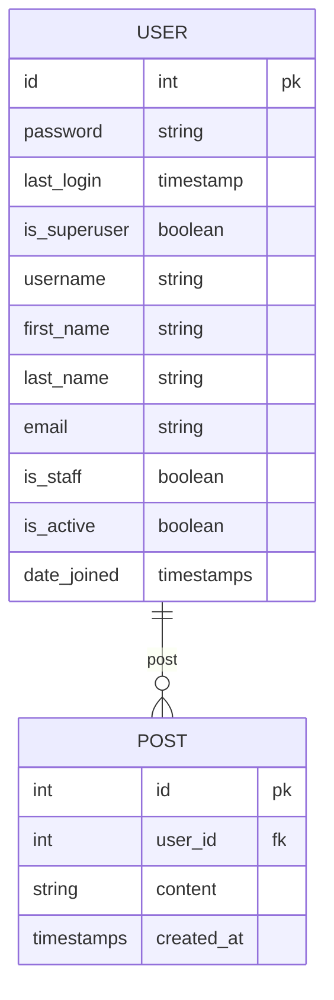

# Mini twitter

API Rest que busca simular o comportamento básico do twitter:
    - Postar
    - Ver posts de outros usuários

A api foi construida com Django, e usa postgres como banco de dados

Diagrama de entidade relacional da aplicação:

