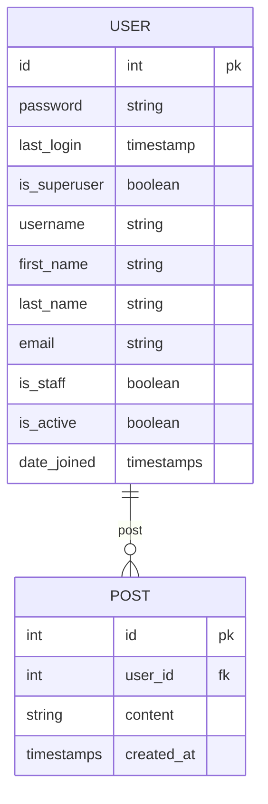

# Mini twitter

Replica minimalista do twitter feita com django, onde se tem uma versão minimalista do twitter.

Diagrama de entidade relacional da aplicação:

```mermaid
erDiagram
    USER ||--o{ POST : post
    USER {
        id int pk
        password string
        last_login timestamp
        is_superuser boolean
        username string
        first_name string
        last_name string
        email string
        is_staff boolean
        is_active boolean
        date_joined timestamps
    }

    POST {
        int id pk
        int user_id fk
        string content
        timestamps created_at
    }
```
